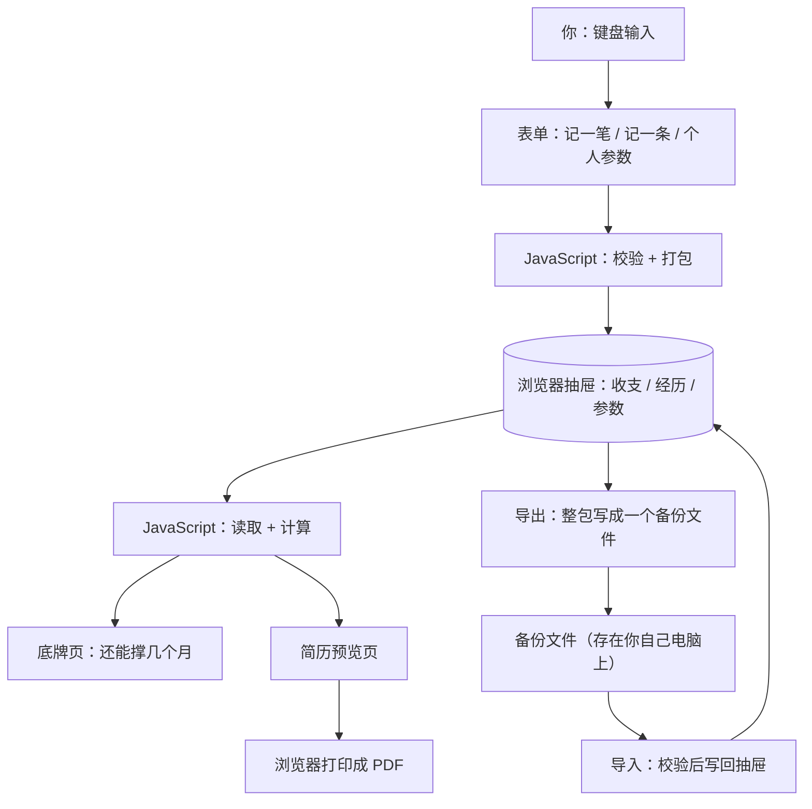

# 简册 · 技术设计文档（TECH_DESIGN.md）

> 版本：v1.2 ｜ 日期：2026-09-20（Day 5）
> 修订记录：v1.0 初稿 → v1.1 按秋鹰师拍板修订（新增 `updatedAt` 字段、经历记录改为起止时间、新增导出/导入数据功能、确认单文件结构、确认改写 `index.html`、数据流图入库）→ v1.2 收尾同步（备份文件定为**明文不加密**；3 处差异已同步进 PRD，PRD 升 v1.2）
> 上游文档：`PRD.md`（Day 4 需求，现已 v1.2）、`research.md`（Day 3 研究）
> 本文回答：「用哪些零件拼、数据从哪来、到哪去、出错了怎么办」
> 本文**不回答**：「每个页面长什么样、按钮点下去的具体反馈」（那在 PRD）
> 本期状态：**只有设计，不含任何可运行代码**；写代码从第 2 周开始（以当天清单为准）
> **与 PRD 的口径已对齐** —— 3 处差异已于 2026-09-20 同步进 PRD v1.2（见第十一节）

---

## 一、技术路线（一句话）

> **技术路线：纯前端单页应用 —— 单个 `index.html`（HTML + CSS + 原生 JavaScript 写在一起），数据存浏览器自带的 `localStorage`，零后端、零数据库、零第三方依赖，双击文件即可运行。**

### 为什么选它（5 条理由）

| # | 理由 | 说明 |
|---|---|---|
| 1 | **与 PRD 口径一致** | PRD 第七节已定「纯前端、单文件、双击打开」，选它能做到零返工 |
| 2 | **26 天预算内唯一做得完** | 不用学后端、数据库、服务器运维，省下的时间全用在产品本身 |
| 3 | **费用 0 元** | 不需要服务器、域名、数据库订阅 |
| 4 | **天然满足「断网可用」** | 全程没有网络请求，就不存在「网断了用不了」这类故障（对应 PRD 8.6 验收标准） |
| 5 | **排错面最小** | 只可能在三个地方出错：页面、逻辑、抽屉。不用查网络、不用查服务器日志 |

### 什么情况下会换掉它（3 个触发条件）

| 触发条件 | 为什么必须换 | 本期是否触发 |
|---|---|---|
| 数据要跨设备（换电脑、手机也能看） | 数据必须离开本机、放到服务器上 | 否（本期用备份文件手动搬，见 10.3） |
| 要把简历变成一条链接发给别人 | 别人要能访问，就得有服务器和网址 | 否（PRD 第六节已砍） |
| 数据量或查询复杂度超出浏览器能力 | 需要真正的数据库 | 否（个人账本远达不到） |

**三个条件都没触发，本期沿用纯前端。**

---

## 二、数据流（数据从哪来、到哪去）

### 2.1 数据流图



### 2.2 怎么读这张图（三句话）

1. **从上往下**：你的键盘是最上游，抽屉在中间，页面显示是最下游。
2. **全部节点都在同一个方框世界里** —— 你的电脑。图里**没有任何一个节点是「服务器」**。
3. **唯一的例外是右边那一支**：导出会把数据变成一个备份文件落到你硬盘上；导入再把它读回来。这是本期唯一让数据「离开浏览器」的方式，而且全程由你手动操作。

### 2.3 六种动作的完整路径

| # | 你做什么 | 数据从哪来 | 经过谁 | 存到哪 | 最后到哪去 |
|---|---|---|---|---|---|
| 1 | 记一笔（新增） | 你在表单填的金额、分类、日期 | JavaScript 校验 + 打包 | 抽屉：收支记录 | 流水列表多一条；底牌页三个数字重算 |
| 2 | 改一笔 / 删一笔 | 你对已有记录的修改 | JavaScript 按 `id` 找到那条，替换或移除 | 抽屉：收支记录 | 列表和合计数同步变化 |
| 3 | 记一条（经历） | 你填的起止时间、「做成了什么」 | JavaScript 校验 + 打包 | 抽屉：经历记录 | 经历列表和简历预览页同步更新 |
| 4 | 填个人参数 | 存款、手填月均支出 | JavaScript 打包 | 抽屉：个人参数 | 底牌页「还能撑几个月」立即重算 |
| 5 | 看简历 → 导出 PDF | 抽屉里的经历记录 | JavaScript 读取、按时间排序 | **不存**（只读） | 页面上排成一份简历 → 浏览器打印成 PDF |
| 6 | 导出备份 / 导入备份 | 抽屉里的全部数据 / 一个备份文件 | JavaScript 打包成文件 / 校验后写回 | 备份文件存到你电脑 / 抽屉 | 换电脑时导回来；误删数据时可以恢复 |

### 2.4 三条边界（设计约束）

1. **图里没有一条线指向服务器**。整条链路上不存在「上传」这个动作 —— 这是本方案最重要的特征。
2. **两组数据互不相通**：收支记录和经历记录放在抽屉的不同格子里，删一边不影响另一边（对应 PRD 8.6 验收标准）。
3. **两个「出口」都要你亲自动手**：简历要给别人看，靠浏览器打印成 PDF；数据要换台电脑，靠导出文件再导入。**没有一步是自动的。**

---

## 三、方案对比（3 套）

### 3.1 三套方案分别是什么

| 代号 | 方案 | 一句话说明 |
|---|---|---|
| **A** | 纯前端 + 浏览器本地存储 | 页面、逻辑、数据全在你自己的浏览器里 |
| **B** | 纯前端 + 云数据库（Serverless） | 页面还是本地的，数据存到云上（不用自己搭服务器） |
| **C** | 前端 + 自建后端 + 云数据库 | 完整三层：页面、服务器程序、数据库 |

### 3.2 四个维度对比

| 维度 | A 纯前端 + 本地存储 | B 前端 + 云数据库 | C 前端 + 自建后端 + 数据库 |
|---|---|---|---|
| **学习成本** | 最低：只学 HTML / CSS / JavaScript 三样 | 中：再加云平台控制台、SDK、数据权限规则 | 最高：再加服务端语言、数据库、接口设计、部署运维 |
| **线上持久化** | 无。数据只在这台电脑这个浏览器里 | 有。换设备、换浏览器数据都在 | 有 |
| **费用** | 0 元 | 有免费额度，超出按量计费（具体额度与价格**未核实**） | 服务器 + 数据库按月付费（具体价格**未核实**） |
| **排错难度** | 最低：只有三处可能出错，浏览器按 F12 就能看 | 中：多出网络请求、身份鉴权、云端权限三处看不见的环节 | 最高：本地代码 + 服务器 + 数据库 + 网络，四层都可能出错 |
| 26 天能否完成 | 能 | 很紧 | 不能 |
| 与 PRD 是否冲突 | 不冲突 | 与第六节「不做云端同步」冲突 | 与第六、七节冲突 |

### 3.3 推荐结论

**推荐 A（纯前端 + 浏览器本地存储）。**

四条理由：

1. **不返工**：PRD 已定死这个口径，选 A 不用回头改 PRD。
2. **做得完**：26 天里唯一能走到「发布」这一步的方案。
3. **零成本**：不用为学习过程付任何服务费。
4. **排错面最小**：对零基础来说，「能自己定位问题」比「功能多」重要得多。出错时只可能在三个地方，而不是七层看不见的黑盒。

**选 A 的代价：**

- 换电脑、换浏览器，数据**不会自动跟着走** —— 本期靠「导出备份文件 → 在新电脑导入」手动搬（见 10.3）。
- 清空浏览器数据会**永久丢失**全部记录，**必须靠你提前导出备份兜底**（见 10.4）。

**B / C 不是错的，是「以后的事」**：从 A 迁过去的路径写在第十节 10.2。

---

## 四、项目结构

### 4.1 现在（Day 5 的实际状态）

```
D:\梦空间\
├─ AGENTS.md            我的规则文件（Day 1）
├─ README.md            项目简介（Day 2，最后阶段会完善）
├─ research.md          需求研究（Day 3）
├─ PRD.md               产品需求（Day 4）
├─ TECH_DESIGN.md       技术设计（Day 5，本文档）
├─ index.html           Day 2 的占位页，双击能打开
├─ .gitignore           不进仓库的名单
├─ notes\               学习笔记
└─ .workbuddy\          本地工作记录（已加入 .gitignore，不上传）
```

### 4.2 产品形态：**确定为单个 `index.html`**

（2026-09-20 秋鹰师拍板：不拆分，用单文件。）

**只有一个文件需要关心：`index.html`。**

- 双击它 → 浏览器打开 → 就是简册
- 不需要安装任何东西、不需要启动服务、不需要敲命令行
- HTML（骨架）、CSS（装修）、JavaScript（大脑）都写在这一个文件里

**Day 2 的占位页怎么处理**：直接**改写** `index.html`，把占位内容替换成产品页面，**不新建文件**。（2026-09-20 秋鹰师拍板。）

### 4.3 什么时候该拆（预警线，不是现在做）

| 症状 | 说明 | 怎么拆 |
|---|---|---|
| `index.html` 超过约 500 行 | 改一个按钮的样式要滚很久 | 把 `<style>` 里的内容搬到 `styles.css`，`<head>` 里用 `<link>` 引它 |
| 找个逻辑要翻很久 | 点击处理、算账、存取混在一起 | 把 `<script>` 里的内容搬到 `app.js`，用 `<script src>` 引它 |
| 文件超过 3 个还是乱 | 说明需要按功能分目录 | 再考虑 `css\`、`js\` 子目录 |

**拆完依然是「双击打开即用」**（本地文件互相引用不需要服务器）。

**这是预警，不是今天的任务** —— 今天不创建 `styles.css` / `app.js`。真到了那条线，先跟我说，再动手。

---

## 五、数据字段（三组数据 + 存储设计）

### 5.1 收支记录（抽屉第 1 格）

| 字段 | 类型 | 必填 | 说明与示例 |
|---|---|---|---|
| `id` | 文本 | 系统生成 | 唯一编号，用来定位这一条 |
| `date` | 文本（日期） | 是 | 默认今天；例 `2026-09-20` |
| `amount` | 数字 | 是 | 金额，**正数**，最多两位小数；例 `38.50` |
| `type` | 二选一 | 是 | `收入` / `支出` |
| `category` | 固定选项 | 是 | 按收/支分两组：支出＝餐饮 / 交通 / 房租 / 购物 / 医疗 / 娱乐 / 其他；收入＝工资 / 兼职 / 理财收益 / 其他 |
| `note` | 文本 | 否 | 不超过 50 字；例 `楼下快餐` |
| `createdAt` | 文本（时间） | 系统生成 | 记录创建时间 |
| `updatedAt` | 文本（时间） | 系统生成 | **最后修改时间；新增和每次编辑都会刷新** |

### 5.2 经历记录（抽屉第 2 格）—— **已改为起止时间**

| 字段 | 类型 | 必填 | 说明与示例 |
|---|---|---|---|
| `id` | 文本 | 系统生成 | 唯一编号 |
| `startDate` | 文本（日期） | 是 | **开始时间**，默认今天；例 `2025-03-01` |
| `endDate` | 文本（日期） | 否 | **结束时间**；**不填 = 到现在还在做** |
| `content` | 文本 | 是 | 做成了什么，一句话；例 `把首页加载从 5 秒压到 2 秒` |
| `org` | 文本 | 否 | 公司 / 团队 |
| `role` | 文本 | 否 | 职位 |
| `result` | 文本 | 否 | 量化结果；例 `响应快 3 秒` |
| `tags` | 文本（可多个） | 否 | 技能 / 关键词；例 `性能优化`、`React` |
| `createdAt` | 文本（时间） | 系统生成 | 创建时间 |
| `updatedAt` | 文本（时间） | 系统生成 | 最后修改时间 |

**简历预览页的排序规则**（本次拍板带来的新规则）：

1. 先按 `endDate` 从晚到早排；
2. `endDate` 为空的（还在做的），**排在最前面**；
3. 两条 `endDate` 相同的，按 `startDate` 从晚到早排。

### 5.3 个人参数（抽屉第 3 格）

| 字段 | 类型 | 必填 | 说明与示例 |
|---|---|---|---|
| `savings` | 数字 | 是 | 可动用的钱（能立刻拿出来花的）；例 `30000` |
| `monthlyExpense` | 数字 | 否 | 手填月均支出；不填就用近 3 个自然月记账自动算 |
| `updatedAt` | 文本（时间） | 系统生成 | 最后修改时间 |

**唯一的计算公式**（口径见 PRD 第五节）：

```
还能撑几个月 = 可动用存款 ÷ 月均支出
```

### 5.4 存储设计

抽屉里分成四个格子，每格一个名字（key）：

| 格子 | 名字（key） | 存什么 |
|---|---|---|
| 第 1 格 | `jiance.v1.expenses` | 全部收支记录 |
| 第 2 格 | `jiance.v1.entries` | 全部经历记录 |
| 第 3 格 | `jiance.v1.profile` | 个人参数 |
| 第 4 格 | `jiance.v1.meta` | 数据结构版本号、首次使用时间 |

**命名规则**：`jiance`（项目名）+ `v1`（版本号）+ 内容名。

- **为什么带版本号**：以后字段结构变了，能一眼认出哪些是旧数据，才好做迁移（见第十节 10.1）。
- **抽屉只认文字**：存进去之前要把数据转成文字，读出来时再还原（技术上叫 JSON 序列化）。所以**日期一律存 `2026-09-20` 这样的文字，不存日期对象** —— 这条对将来上后端也很关键。

### 5.5 备份文件的格式（新增）

导出的备份是**一个 `.json` 文件**，里面装这几样：

| 部分 | 内容 | 作用 |
|---|---|---|
| `format` | 固定标识 | 导入时用它认出「这确实是简册的备份」 |
| `version` | 数据结构版本号（现在是 `1`） | 导入时判断能不能读懂 |
| `exportedAt` | 导出时间 | 你自己看什么时候备份的 |
| `expenses` | 全部收支记录 | 数据本体 |
| `entries` | 全部经历记录 | 数据本体 |
| `profile` | 个人参数 | 数据本体 |
| `meta` | 首次使用时间等 | 数据本体 |

**文件命名规则**：`jiance-backup-2026-09-20.json`（项目名 + 日期，方便你自己认）。

**文件是明文的（已定，2026-09-20）**：用记事本打开就能看懂里面所有内容。理由：数据只在本机，加密会多出「忘记密码 = 自己的数据打不开」这个新风险，收益小于代价。

---

## 六、API 列表

### 6.1 本期：没有网络接口，只有浏览器内置 API

**本期不存在任何 HTTP 接口**（没有 `GET /api/...` 这种东西），因为根本没有后端。

但前端自己要用到浏览器提供的这些现成工具，它们就是本期的「API」：

| API | 干什么（大白话） | 用在哪 |
|---|---|---|
| `localStorage.setItem` / `getItem` | 往抽屉塞东西 / 从抽屉拿东西 | 所有保存与读取 |
| `JSON.stringify` / `JSON.parse` | 把数据变成文字 / 把文字还原成数据 | 每次存取（抽屉只认文字） |
| `document.querySelector` | 在页面上找到某个元素 | 取输入框的值、改显示的文字 |
| `addEventListener` | 监听「点击」「提交」这些动作 | 所有按钮 |
| `Date` | 取今天的日期、判断当前是几月 | 表单默认日期、「本月」统计、「近 3 个自然月」 |
| `Intl.NumberFormat`（可选） | 把 `12345.6` 显示成 `12,345.6` | 金额显示 |
| `window.print()`（可选） | 唤起浏览器打印窗口 | 简历预览页的「打印」按钮 |
| `Blob` + `URL.createObjectURL` | 在浏览器内存里造一个文件，并给它一个临时下载地址 | **导出备份** |
| `<a download>` | 让浏览器把这个文件下载下来 | **导出备份** |
| `<input type="file">` + `FileReader` | 弹出选文件的窗口，把选中的文件内容读出来 | **导入备份** |

「可选」的含义：不做也能用（用户可以用浏览器菜单或快捷键打印），做了体验更好。

### 6.2 将来上后端时，接口会长这样（设计参考，本期不实现）

| 本期动作 | 将来对应的接口 | 说明 |
|---|---|---|
| 新增一笔收支 | `POST /api/expenses` | 提交一条新记录 |
| 读某月流水 | `GET /api/expenses?month=2026-09` | 按月份查 |
| 改 / 删一笔 | `PUT /api/expenses/:id`、`DELETE /api/expenses/:id` | 按 id 操作 |
| 新增 / 改 / 删经历 | `POST` / `PUT` / `DELETE /api/entries` | 同理 |
| 读 / 存个人参数 | `GET` / `PUT /api/profile` | 同理 |
| 备份 / 恢复（本期是文件） | `GET` / `POST /api/backup` | 上了后端后可以改成云备份 |
| 登录（本期完全没有） | `POST /api/auth/login` | 上了后端才会出现 |

**本表是「将来会有什么」的预告，不是本期要做的功能。**

---

## 七、错误处理

### 7.1 处理原则（一句话）

**宁可显示一句人话提示，也绝不显示错的数字。**

（PRD 8.2 就是这条原则的体现：数据不够时显示「先填一下你能动用的存款」，不显示 0、不显示 NaN。）

### 7.2 会出错的地方 + 怎么办

| # | 哪里会出错 | 现象 | 怎么处理 |
|---|---|---|---|
| 1 | 抽屉塞满了 | 保存失败 | 抽屉有容量上限（各浏览器不同，**未逐一核实**）。账本数据量很小，正常用远到不了；真到上限时提示「存储空间不足」，**不允许静默失败** |
| 2 | 抽屉里的数据被改坏 | 打开页面读不出来 | 解析失败时显示「数据读取失败」，**并且绝不覆盖原有数据**（避免把仅存的一份也写坏） |
| 3 | 浏览器禁用了本地存储（如隐私模式） | 保存不了 | 启动时先试写一次，失败就直接提示「当前浏览器设置不允许保存数据」，**不假装保存成功** |
| 4 | 必填项没填、金额填 0 或负数 | — | 不保存，并指出缺哪一项（PRD 8.3、8.4 已定义） |
| 5 | `endDate` 早于 `startDate` | — | 不保存，提示「结束时间不能早于开始时间」（新增字段带来的校验） |
| 6 | 算「能撑几个月」时分母为 0 或没数据 | — | 走引导文案，**绝不显示 0 / Infinity / NaN**（PRD 8.2） |
| 7 | 电脑系统时间不对 | 月份统计出错 | 不报错（属环境问题）；说明「本月」按系统时间判定 |
| 8 | 刷新页面丢了没保存的内容 | — | **属预期行为**，PRD 8.1 已声明，不做额外处理 |
| 9 | 打印简历时把导航条也打出来 | 纸上多出没用的东西 | 加一段「打印时隐藏」的样式规则 |
| 10 | 导入的文件不是简册的备份 | — | 先检查 `format` 标识，不对就提示「这不是简册的备份文件」，**不写入任何数据** |
| 11 | 导入的文件损坏 / 读不出来 | — | 提示「文件读不出来，可能已损坏」，**原有数据一动不动** |
| 12 | 导入的版本比当前程序新 | — | 提示「这份备份来自更新的版本」，**不强行导入** |
| 13 | 导入会覆盖现有数据 | — | 必须二次确认；并提示「建议先导出一份当前数据」再覆盖（双保险） |
| 14 | 导出时浏览器拦下了下载 | — | 提示「如果没看到文件下载，请检查浏览器的下载拦截设置」 |

---

## 八、环境变量

### 8.1 结论

**本期没有环境变量，也不创建 `.env` 文件。**

### 8.2 什么是环境变量（大白话）

想象你要出门办事，先在口袋里揣一张纸条，写着「要去哪、密码是多少」。程序也一样：有些配置不适合直接写在代码里（尤其是密码），就放在外面，运行时再拿进来。**这个东西叫环境变量，它属于「有服务器」的世界。**

### 8.3 本期为什么不需要

| 原因 | 说明 |
|---|---|
| 没有后端 | 没有服务器，就没地方放配置 |
| 没有任何密钥 | 不连数据库、不调第三方接口，没有密码要藏 |
| 没有构建步骤 | 不打包、不编译，也就没有「打包时读配置」这一步 |

### 8.4 但这条红线现在就立好（给将来）

| 将来会出现什么 | 例子 | 谁能看到 |
|---|---|---|
| 数据库连接串 | `DATABASE_URL` | **只在服务器上**，绝不写进代码、绝不进提交 |
| 登录会话密钥 | `SESSION_SECRET` | 同上 |
| 允许访问的站点来源 | `ALLOWED_ORIGIN` | 同上 |

**为什么现在写**：`.gitignore` 里已经配好了 `.env` 的忽略规则（Day 2 做好的）。将来一旦加后端，密钥必须走环境变量，**永远不进代码、不进提交**。

---

## 九、部署

### 9.1 本期：部署 = 复制文件

| 问题 | 答案 |
|---|---|
| 自己用 | 双击 `index.html` |
| 给别人用 | 把这个文件发给他（微信、邮件都行），他也双击打开 |
| 需要服务器吗 | 不需要 |
| 需要域名吗 | 不需要 |
| 需要打包 / 编译吗 | 不需要 |

### 9.2 将来要上线时（最后 2–3 天可能做，今天不做）

| 项 | 说明 |
|---|---|
| 最省事的方式 | 静态托管，例如 GitHub Pages（把仓库里的 HTML 直接变成网址） |
| 费用 | 公开仓库通常免费（**具体政策未核实**） |
| 要注意的三件事 | ① 文件引用要用相对路径（上线后会挂在子路径下）② 只能放静态文件 ③ 上线后数据仍只存在每个访问者自己的浏览器里 |
| 最后一条最容易误解 | **上线不等于数据上云**：网址给你的是「程序」，不是「你的数据」。你打开线上网址，看到的是空的 |

---

## 十、迁移注意事项

### 10.1 数据结构变了怎么办（防「改字段丢数据」）

| 原则 | 怎么做 |
|---|---|
| 只加不改名 | 需要新字段就加，老的先留着不用 |
| 带版本号 | 抽屉名字里已有 `v1`；结构变了就写 `v2`，能同时认出新旧数据 |
| 读到旧数据先补齐 | 读到老版本数据时，缺的字段用默认值补上，不直接报错 |
| 改名前先备份 | 真要改字段名，先让用户导出备份（本期已有这个功能，见 10.4） |

**一个现成的例子**：本次给收支记录加了 `updatedAt`。第 2 周写代码时，如果市面上已经有你手动存进去的老记录（它们没有这个字段），读的时候要按「缺失就补当前时间」处理，**不能因为缺字段就报错**。

### 10.2 从 A 方案迁到 B / C（上后端）要改什么

| 要改的 | 怎么改 | 提前要做的准备（第 2 周起就遵守） |
|---|---|---|
| 存 / 取数据那一层 | 把「写抽屉」换成「发请求」 | **所有抽屉读写只写在一个地方** |
| 日期格式 | 不用改 | 现在就存 `2026-09-20` 文字，不存日期对象 |
| 记录的唯一编号 | 不用改 | 现在就有 `id`，将来能对上数据库主键 |
| 修改时间 | 不用改 | 现在就记 `updatedAt`，将来做同步冲突判断要用 |
| 「这是谁的数据」 | 加账号 | 现在不用管 |
| 数据要能上传 | 不用改 | 现在存的就是纯数据，不含函数等「传不走」的东西 |
| 备份方式 | 从「下载文件」换成「云备份接口」 | 备份文件的结构可以直接沿用（见 5.5） |

**结论：只要第 2 周守住「抽屉读写集中在一处」+「只存纯数据」这两条，将来上后端不用重写页面。**

### 10.3 换设备 / 清浏览器数据（**本次已改善**）

| 情况 | 后果 | 怎么办 |
|---|---|---|
| 换电脑、换浏览器 | 数据不会自动跟着走 | **在老设备导出一个备份文件 → 在新设备导入**（本期新增这个功能，不是自动的，要你手动搬） |
| 清浏览器缓存 / 重置浏览器 | 数据永久丢失 | 只能靠**提前导出**的备份恢复；备份之后新记的内容找不回来 |
| 手机上看 | 本期不支持 | 本期只做电脑上的网页文件 |

**一句话**：备份文件就是本期的「数据搬运工具」和「后悔药」。**它救不回你从没导出过的数据。**

### 10.4 导出 / 导入功能定案（本次拍板）

秋鹰师 2026-09-20 拍板：**加这个功能。**

加它的三条理由：

1. **数据只有一份**，就躺在这台电脑的这个浏览器里；
2. **清浏览器数据不可逆**，没有第二份就永久没了；
3. **换电脑要能搬数据**，否则攒了几个月的记录等于白记。

**范围界定（防止功能膨胀）：**

| 做 | 不做 |
|---|---|
| 一键导出成**一个** `.json` 备份文件 | 不做云备份、不做自动定时导出 |
| 从备份文件导入回来，带格式校验和二次确认 | 不做多份历史备份管理、不做备份对比 |
| 导入前提示先备份当前数据 | 不做备份文件加密（**已定**，2026-09-20） |

---

## 十一、与 PRD 的差异（**已同步**）

> 2026-09-20：下列 3 处差异**已同步进 PRD**，PRD 升到 **v1.2**。两份文档现在口径一致，可以对照看。

| # | 原本的差异 | PRD v1.2 现在的写法 | 原因 |
|---|---|---|---|
| 1 | 经历记录只有一个 `date` 字段 | 已改为 `startDate`（必填）+ `endDate`（选填，不填 = 还在做） | 秋鹰师 2026-09-20 拍板「要起止时间」 |
| 2 | MVP 只含三个功能（记一笔 / 记一条 / 看底牌） | 已新增**第四个功能「导出 / 导入数据」**（PRD 功能 4 + 验收标准 8.7） | 拍板：防数据永久丢失 + 换设备搬数据 |
| 3 | 字段表未提 `updatedAt` | 三组数据字段表都加了 `updatedAt` | 为将来上后端做同步预留 |
| 4 | PRD 未指定项目结构的文件数量 | **无需改动**（PRD 第七节本来写的就是单个 `index.html`） | 口径本来就一致 |
| 5 | PRD 未说明 Day 2 占位页的去向 | **无需改动**（属实施细节，PRD 不写） | — |

**连带一起同步进 PRD 的**（不然仍会打架）：

- 简历排序规则：`endDate` 倒序、**还在做的排最前**（PRD 5.2 新增 + 8.4 / 8.5 改写）
- 经历列表排序：由「按日期倒序」改为「按结束时间从新到旧」（PRD 功能 2 可观察结果 + 第四节页面表）
- 导出 / 导入的入口位置：写进 PRD 第四节，明确**放底牌页「设置个人参数」区**
- PRD 第十节「待确认」新增 2 条（入口位置、备份不加密）

**仍待确认一项**：导出 / 导入的入口位置是 **AI 的默认选择**（理由：数据管理属于「设置」性质，且是低频操作），等秋鹰师点头；想挪到导航条右侧只需改 PRD 第四节一处。

---

## 十二、待确认 / 风险

| # | 事项 | 状态 |
|---|---|---|
| 1 | 项目结构：单文件 | **已定**（单文件，2026-09-20） |
| 2 | 要不要加导出 / 导入数据 | **已定**（加，见 10.4） |
| 3 | 经历记录起止时间 | **已定**（加，见 5.2） |
| 4 | 加 `updatedAt` | **已定**（加，见 5.1 / 5.2 / 5.3） |
| 5 | `index.html` 改写还是新建 | **已定**（改写，见 4.2） |
| 6 | 把 3 处差异同步进 PRD | **已办**（2026-09-20，PRD 升 v1.2，见第十一节） |
| 7 | 备份文件要不要加密 | **已定**：不加密（2026-09-20 拍板）。备份是**明文** `.json`，用记事本就能看全部内容。理由：数据只存本机，加密会多出「忘记密码 = 自己的数据打不开」这个新风险，收益小于代价 |
| 8 | 云服务价格与免费额度 | **未核实**（本期用不到，真要上后端时再查） |
| 9 | 各浏览器本地存储容量上限 | **未逐一核实**（各浏览器不同） |
| 10 | 导出 / 导入的入口位置 | **默认选择**：底牌页「设置个人参数」区（2026-09-20），待秋鹰师确认 |

---

*本文档由 Day 5 任务产出；不含可运行代码，写代码从第 2 周开始。*
