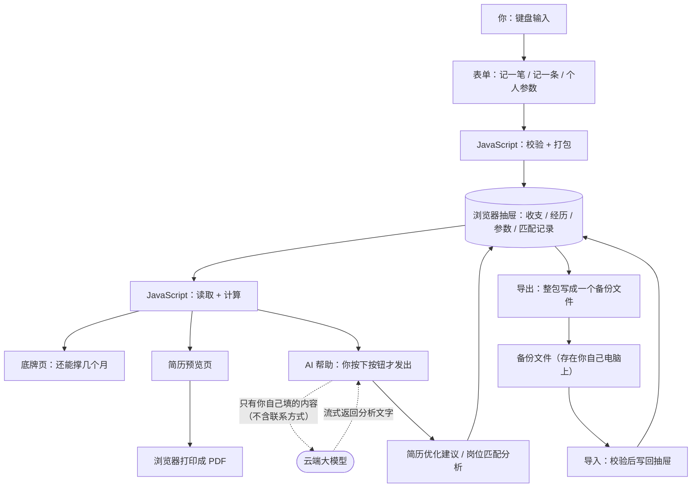

# 简册 · 技术设计文档（TECH_DESIGN.md）

> 版本：v1.13 ｜ 日期：2026-10-03（Day 17 视觉重建 v2 落地：双面材质 + 全站放大 + 线条图标 + 打印件治理）
> v1.12（2026-10-01）→ v1.13（2026-10-03）核心变化 = ①**双面材质终于分开**（4.3 新增：账簿面深褐纸 / 简历面真玻璃，判定用 Day 15 就挂好的 `.page-ledger` / `.page-resume`，不动 JSX）②**全站字号版面基准化**（8 档 `--fs-*` + `--page-w` / `--card-pad`，散落的 70 处 px 全部改为引用变量）③**新增线条图标库**（`components/Icon.jsx` 19 个，零外部依赖）④**打印件治理**（撕除规则从散在 `Resume.css` 改为 `index.css` 唯一总闸，岗位匹配页打印白纸的旧 bug 一并修掉）
> v1.11（2026-09-30）→ v1.12（2026-10-01）核心变化 = ① 单文件改 React + Vite 项目（`projects/jiance/`） ② 上 CloudBase 后端（1 个探路石接口 `/api/health`） ③ 主页（卡牌台）骨架 1:1 实现，5 个功能页 1:1 复刻推 Day 16-20
> 修订记录：v1.0 初稿 → v1.1 按秋鹰师拍板修订（新增 `updatedAt` 字段、经历记录改为起止时间、新增导出/导入数据功能、确认单文件结构、确认改写 `index.html`、数据流图入库）→ v1.2 收尾同步（备份文件定为**明文不加密**；3 处差异已同步进 PRD，PRD 升 v1.2）→ v1.3 与 PRD v1.3 对齐：**删掉经历记录的 `tags` 字段**（5.2 字段表）；导出 / 导入口径复核确认仍为「**本地手动** `.json` 文件」，不含云备份与自动定时导出（无改动）→ v1.4 与 PRD v1.4 对齐：**「月」拆成两个口径**（记一笔页合计跟随列表月份 = 当月；底牌页三数按当前自然月 = 本月），本文档正文无实质改动，仅登记同步 → v1.5 与 PRD v1.5 对齐：个人参数**新增 `name` / `contact` 两个选填文本字段**（5.3 字段表），供简历预览页当抬头用；5.5 备份格式表注明 `profile` 里包含它们 → v1.6 与 PRD v1.6 对齐：补两条导入边界口径 —— **导入后流水列表跳到「备份里最新一条记录所在的月份」**（不跳回当前月）、**空备份是合法输入**（10.4 新增一张口径表，5.5 注明四格都允许为空）→ v1.7 与 PRD v1.7 对齐：个人参数**新增 `targetRole`（目标职位）一个选填文本字段**（5.3 字段表、5.5 备份格式表的 `profile` 说明）→ v1.8 与 PRD v1.8 对齐：10.3「手机上看」一行更新为实际状态（**电脑优先 + 手机可用**，响应式断点 900 / 640 / 380，数据仍不跨设备）→ v1.9 与 PRD v1.9 对齐：Day 10 晚间改版 —— 外链口径从「零外链」放宽为「**唯一例外：联网加载思源宋体**（`fonts.loli.net` 镜像，按需分包，`display=swap` 断网退回系统宋体）」（第 2 节第 4 条「断网可用」同步更新措辞）；账簿面背景改用 **feTurbulence 程序化噪声纹理**（SVG data URI 内嵌，仍零图片文件）；新增「本月收支墨线」装饰性数据图（读真实账目，空月整块隐藏，`aria-hidden` 纯装饰不改口径）→ v1.10 与 PRD v1.10 对齐：Day 14 插入任务 —— ①**新增云端大模型通道**（第 6 节新增 6.3，外链例外二：SDK 懒加载）②**第 5 格数据 `jiance.v1.matches` + 草稿键 `jiance.v1.matchDraft`**（5.4 存储设计、5.5 备份格式同步；10.1 迁移原则注明）③**第 5 个视图 `#/match`**（4.2 页面清单）④**个人信息红线与 AI 功能口径**（第 8 节环境变量新增 8.5：前端只放 `publishableKey`）→ **v1.11 与 PRD v1.11 对齐：Day 15 插入任务**——①**新增主界面视图 `#/start`**（4.2 页面清单 5 → 6）；②**默认落地页从 `#/home` 改为 `#/start`**（影响 4.2 实现细节 + 第 6 节路由兜底值）；③**主界面是进入其他页的唯一入口**（导航条收窄到只剩一个「主界面」按钮，底牌页的「记一笔 / 记一条」两个大按钮已收掉）；④**新增「场景穿越」效果**（5 张牌心各有自己的小戏剧——账本翻开 / 笔划过纸面 / 打印纸落下 / 纸面展开 / 雷达图辐射；牌翻 200ms + 场景演约 900ms 后才进页，新页瞬间到位、零动效——守住了 Day 15「页面本身不做任何动效」的纪律）；⑤**新增「装订册手作感」装饰**（5 个功能页各加三件套：装订线 / 暗纹水印 / 边角图章 / 折痕；账簿面用朱 + 竖条纹 + 朱蓝"账"印，简历面用灰 + 点阵网格 + 描边"履"印；**`@media print` 全撕干净**，打印件只剩白纸黑字）。
> **v1.13 与 PRD v1.13 对齐：Day 17 视觉重建 v2 落地** —— ①新增 4.3「双面材质与视觉体系」（深褐 vs 浅米纸的取舍、玻璃看不见的根因、三条架构决策、字号基准化、图标库、打印件验证口径）；②原 4.3「什么时候该拆」顺延为 4.4；③AGENTS.md 新增「附四·视觉实现铁律」七条（与本节互为表里：那边写硬规则，这边写原理）。**本轮只改 CSS 与图标，不动任何数据口径与功能边界**。
> 上游文档：`PRD.md`（Day 4 需求，现已 v1.10）、`research.md`（Day 3 研究）
> 本文回答：「用哪些零件拼、数据从哪来、到哪去、出错了怎么办」
> 本文**不回答**：「每个页面长什么样、按钮点下去的具体反馈」（那在 PRD）
> 本期状态：**主体已实现**（根目录 `index.html`）；本文件随实现同步更新口径
> **与 PRD 的口径已对齐** —— 3 处差异已于 2026-09-20 同步进 PRD v1.2（见第十一节）


---

## 一、技术路线（一句话）

> **技术路线：纯前端单页应用 —— 单个 `index.html`（HTML + CSS + 原生 JavaScript 写在一起），数据存浏览器自带的 `localStorage`，零后端、零数据库、零第三方依赖，双击文件即可运行。**

### 为什么选它（5 条理由）

| # | 理由 | 说明 |
|---|---|---|
| 1 | **与 PRD 口径一致** | PRD 第七节已定「纯前端、单文件、双击打开」，选它能做到零返工 |
| 2 | **26 天预算内唯一做得完** | 不用学后端、数据库、服务器运维，省下的时间全用在产品本身 |
| 3 | **费用 0 元** | 不需要服务器、域名、数据库订阅 |
| 4 | **基本满足「断网可用」** | 除一款**在线字体**（思源宋体，`fonts.loli.net` 镜像，v1.9 起的唯一外链例外）外全程没有网络请求；断网时字体退回系统宋体，功能与数据零影响（对应 PRD 8.6，已随 v1.9 更新措辞） |
| 5 | **排错面最小** | 只可能在三个地方出错：页面、逻辑、抽屉。不用查网络、不用查服务器日志 |

### 什么情况下会换掉它（3 个触发条件）

| 触发条件 | 为什么必须换 | 本期是否触发 |
|---|---|---|
| 数据要跨设备（换电脑、手机也能看） | 数据必须离开本机、放到服务器上 | 否（本期用备份文件手动搬，见 10.3） |
| 要把简历变成一条链接发给别人 | 别人要能访问，就得有服务器和网址 | 否（PRD 第六节已砍） |
| 数据量或查询复杂度超出浏览器能力 | 需要真正的数据库 | 否（个人账本远达不到） |

**三个条件都没触发，本期沿用纯前端。**

---

## 二、数据流（数据从哪来、到哪去）

### 2.1 数据流图


```mermaid
flowchart TD
    U["你：键盘输入"] --> FORM["表单：记一笔 / 记一条 / 个人参数"]
    FORM --> SAVE["JavaScript：校验 + 打包"]
    SAVE --> STORE[("浏览器抽屉：收支 / 经历 / 参数 / 匹配记录")]
    STORE --> READ["JavaScript：读取 + 计算"]
    READ --> V1["底牌页：还能撑几个月"]
    READ --> V2["简历预览页"]
    V2 --> V3["浏览器打印成 PDF"]
    STORE --> E1["导出：整包写成一个备份文件"]
    E1 --> F1["备份文件（存在你自己电脑上）"]
    F1 --> E2["导入：校验后写回抽屉"]
    E2 --> STORE
    READ --> AI["AI 帮助：你按下按钮才发出"]
    AI -. "只有你自己填的内容<br/>（不含联系方式）" .-> CLOUD(["云端大模型"])
    CLOUD -. "流式返回分析文字" .-> AI
    AI --> V4["简历优化建议 / 岗位匹配分析"]
    V4 --> STORE
```

> **虚线是 v1.10 新增的第三条路**：它不是「自动上传」，而是**你按下按钮才发出**，且只带**你自己填的文字**（JD、你的经历、求职偏好），**始终不含 `profile.contact`**（见 6.3 红线）。区别于右边那一支（备份文件）—— 那条路数据不出本机，这条路数据会出本机，所以单独画成虚线并标注清楚。

### 2.2 怎么读这张图（三句话）

1. **从上往下**：你的键盘是最上游，抽屉在中间，页面显示是最下游。
2. **主体全部在同一个方框世界里** —— 你的电脑。图里除右边那支虚线和备份文件外，**没有别的出口**。
3. **右边那一支（备份文件）是数据「离开浏览器」的唯一**手动**方式**：导出会把数据变成一个备份文件落到你硬盘上，导入再把它读回来，全程由你手动操作。
4. **虚线那一支（v1.10 新增）是唯一会出本机的自动通道**，但它有三个前提：①你亲自按下按钮；②只发你自己填的内容；③永远不含联系方式。**不按按钮，它一次都不会触发。**（详见 6.3）

### 2.3 六种动作的完整路径

| # | 你做什么 | 数据从哪来 | 经过谁 | 存到哪 | 最后到哪去 |
|---|---|---|---|---|---|
| 1 | 记一笔（新增） | 你在表单填的金额、分类、日期 | JavaScript 校验 + 打包 | 抽屉：收支记录 | 流水列表多一条；底牌页三个数字重算 |
| 2 | 改一笔 / 删一笔 | 你对已有记录的修改 | JavaScript 按 `id` 找到那条，替换或移除 | 抽屉：收支记录 | 列表和合计数同步变化 |
| 3 | 记一条（经历） | 你填的起止时间、「做成了什么」 | JavaScript 校验 + 打包 | 抽屉：经历记录 | 经历列表和简历预览页同步更新 |
| 4 | 填个人参数 | 存款、手填月均支出 | JavaScript 打包 | 抽屉：个人参数 | 底牌页「还能撑几个月」立即重算 |
| 5 | 看简历 → 导出 PDF | 抽屉里的经历记录 | JavaScript 读取、按时间排序 | **不存**（只读） | 页面上排成一份简历 → 浏览器打印成 PDF |
| 6 | 导出备份 / 导入备份 | 抽屉里的全部数据 / 一个备份文件 | JavaScript 打包成文件 / 校验后写回 | 备份文件存到你电脑 / 抽屉 | 换电脑时导回来；误删数据时可以恢复 |
| 7 | **让 AI 优化简历 / 分析岗位**（v1.10 新增） | 你填的经历内容 / 你粘贴的 JD / 你的求职偏好 | JavaScript 拼提示词 → **云端大模型** → 流式返回 | 抽屉：匹配记录（存当时的 JD 全文 + 分析结果快照） | 页面上显示建议文字；生成的分析可存成一条匹配记录 |

### 2.4 三条边界（设计约束）

1. **主体链路不指向服务器**。除 AI 帮助（你按按钮才触发，见 2.2 第 4 条）外，没有任何自动上传动作 —— 这是本方案最重要的特征。
2. **两组数据互不相通**：收支记录和经历记录放在抽屉的不同格子里，删一边不影响另一边（对应 PRD 8.6 验收标准）。
3. **两个「出口」都要你亲自动手**：简历要给别人看，靠浏览器打印成 PDF；数据要换台电脑，靠导出文件再导入。**没有一步是自动的。**（AI 通道也遵循同一条精神：必须你按按钮。）

---

## 三、方案对比（3 套）

### 3.1 三套方案分别是什么

| 代号 | 方案 | 一句话说明 |
|---|---|---|
| **A** | 纯前端 + 浏览器本地存储 | 页面、逻辑、数据全在你自己的浏览器里 |
| **B** | 纯前端 + 云数据库（Serverless） | 页面还是本地的，数据存到云上（不用自己搭服务器） |
| **C** | 前端 + 自建后端 + 云数据库 | 完整三层：页面、服务器程序、数据库 |

### 3.2 四个维度对比

| 维度 | A 纯前端 + 本地存储 | B 前端 + 云数据库 | C 前端 + 自建后端 + 数据库 |
|---|---|---|---|
| **学习成本** | 最低：只学 HTML / CSS / JavaScript 三样 | 中：再加云平台控制台、SDK、数据权限规则 | 最高：再加服务端语言、数据库、接口设计、部署运维 |
| **线上持久化** | 无。数据只在这台电脑这个浏览器里 | 有。换设备、换浏览器数据都在 | 有 |
| **费用** | 0 元 | 有免费额度，超出按量计费（具体额度与价格**未核实**） | 服务器 + 数据库按月付费（具体价格**未核实**） |
| **排错难度** | 最低：只有三处可能出错，浏览器按 F12 就能看 | 中：多出网络请求、身份鉴权、云端权限三处看不见的环节 | 最高：本地代码 + 服务器 + 数据库 + 网络，四层都可能出错 |
| 26 天能否完成 | 能 | 很紧 | 不能 |
| 与 PRD 是否冲突 | 不冲突 | 与第六节「不做云端同步」冲突 | 与第六、七节冲突 |

### 3.3 推荐结论

**推荐 A（纯前端 + 浏览器本地存储）。**

四条理由：

1. **不返工**：PRD 已定死这个口径，选 A 不用回头改 PRD。
2. **做得完**：26 天里唯一能走到「发布」这一步的方案。
3. **零成本**：不用为学习过程付任何服务费。
4. **排错面最小**：对零基础来说，「能自己定位问题」比「功能多」重要得多。出错时只可能在三个地方，而不是七层看不见的黑盒。

**选 A 的代价：**

- 换电脑、换浏览器，数据**不会自动跟着走** —— 本期靠「导出备份文件 → 在新电脑导入」手动搬（见 10.3）。
- 清空浏览器数据会**永久丢失**全部记录，**必须靠你提前导出备份兜底**（见 10.4）。

**B / C 不是错的，是「以后的事」**：从 A 迁过去的路径写在第十节 10.2。

---

## 四、项目结构

### 4.1 现在（Day 15 的实际状态 · v1.12）

> 这一节随实现推进更新；原文是 Day 5 的版本，已同步为当前状态。**v1.12 重大路线调整**：从单文件 `index.html` 改为 React + Vite。

```
D:\梦空间\
├─ AGENTS.md            我的规则文件（Day 1 → 现 v1.12，附三新增 React/Vite 术语）
├─ README.md            项目简介（Day 2 → 现 v1.12）
├─ research.md          需求研究（Day 3 → 现 v1.12）
├─ PRD.md               产品需求（Day 4 → 现 v1.12）
├─ TECH_DESIGN.md       技术设计（Day 5 → 现 v1.12，本文档）
├─ .gitignore           不进仓库的名单
├─ notes\               学习笔记
├─ projects\            练习与技能文件（一个功能一个文件夹）
│   ├─ jiance\          **简册本体**（v1.12 起）— React + Vite 项目
│   │   ├─ package.json   依赖清单 + npm 命令
│   │   ├─ vite.config.js Vite 构建配置
│   │   ├─ index.html     React 入口 HTML（与旧版同名但**目录不同**）
│   │   ├─ src\           React 源码
│   │   │   ├─ main.jsx     React 启动点 + HashRouter
│   │   │   ├─ App.jsx     路由表
│   │   │   ├─ pages\       6 个页面（Start/Home/Expense/Entry/Resume/Match）
│   │   │   ├─ components\  通用组件（Nav 等）
│   │   │   ├─ hooks\       自定义 hook（localStorage 适配等）
│   │   │   └─ styles\      CSS（按页面拆分）
│   │   ├─ dist\          `npm run build` 产物（部署用，不进仓库）
│   │   ├─ node_modules\  npm 安装的依赖（不进仓库）
│   │   └─ cloudbase\     CloudBase 后端预制件（DEPLOY.md / api-contract.md / functions/）
│   ├─ job-matcher\     岗位匹配技能包（SKILL + 参考文档 + 本机适配说明）
│   └─ ...              其余练习
└─ .workbuddy\          本地工作记录（已加入 .gitignore，不上传）
```

**归位规则**（AGENTS.md 附三第 1 条）：根目录只放说明文档；**代码 / 静态页面一律进 `projects\`**。`projects/jiance/` 是 v1.12 起简册本体的根目录。

### 4.2 产品形态：**v1.12 改为 React + Vite**

（2026-10-01 Day 15 重大路线调整；原 2026-09-20 拍板的"单文件"作废。）

**为什么改**：
- **React 的核心好处**（零件复用 / 改一处全变 / 生态丰富 / 多人协作）对简册**几乎都用不上**——简册零依赖、单人、Day 13 之前的手写 JS 已经实现了"响应式联动"。改 React **不是能力升级，是范式重写**。
- **改的真实原因**：为第 3 周接 CloudBase 后端 + 长期维护打基础。React 的组件化让"逐页 1:1 复刻" + "装订册三件套" + "场景穿越戏剧"更容易工程化。
- **代价**：单文件版的"双击就能开"没了——需要 `npm install` + `npm run dev` 才能本地跑，部署用 `npm run build` 输出 `dist/`。Day 1 拍板的"零外部依赖"原则由"严格零外部依赖"放宽为"业务零外部依赖 / 工具零依赖放开"——react / react-dom / react-router-dom 是工具，不算业务依赖。

**v1.12 单文件 → React 改造没做完的事**（推到 Day 16-20）：
1. 5 个功能页完整 1:1 复刻（账簿面朱砂栏线 / 简历面真玻璃 / 双面对称布局 / print 还原白纸黑字）
2. 装订册三件套（装订线 + 暗纹水印 + 边角图章 + 折痕 + @media print 撕干净）
3. 场景穿越动画（5 张牌各自的 900ms 小戏剧）
4. AI 通道迁移（WorkBuddy 网关 → 集成到 React 项目 `src/services/llm.js`）
5. 联动板块①（底牌三数 + 简历抬头 + 匹配重跑）
6. 自检脚本（Temp/png_scan.js 重写适配 React）

**周六 Q&D（v1.12 已实现）**：
- 主页（卡牌台）骨架 1:1 — 5 张牌沿浅弧排列 + 鼠标跟随倾斜 + 点击翻牌跳转
- 5 个占位页（明确标注推到哪天复刻）
- Nav 收窄到只剩"主界面"按钮（AGENTS 附三第 2 条"主界面是唯一入口"纪律）
- `npm run build` 通过（dist 263 KB JS + 3 KB CSS）

**六个视图与门牌号**（v1.11 起；v1.12 用 React Router 改造）：

| 面 | 页面 | 门牌号 | 实现方式（v1.12） |
|---|---|---|---|
| — | **主界面** | `#/start` | `<Route path="/start" element={<Start/>} />`，**v1.11 起为默认落地页** |
| 账簿面 | 底牌页 | `#/home` | `<Route path="/home" element={<Home/>} />` |
| 账簿面 | 记一笔 | `#/expense` | `<Route path="/expense" element={<Expense/>} />` |
| 简历面 | 记一条 | `#/entry` | `<Route path="/entry" element={<Entry/>} />` |
| 简历面 | 简历预览 | `#/resume` | `<Route path="/resume" element={<Resume/>} />` |
| 简历面 | 岗位匹配 | `#/match` | `<Route path="/match" element={<Match/>} />`（v1.10 新增） |

**路由实现**（v1.12）：用 **`react-router-dom` 的 `HashRouter`**（不用 BrowserRouter —— 不需要服务器配 nginx 兜底）。`src/main.jsx` 包一层 `<HashRouter>`，`src/App.jsx` 写 `<Routes>` + 6 个 `<Route>`。不在白名单的地址由 React Router 自动处理（404）。

**场景穿越**（v1.11 拍板，v1.12 推迟）：主界面的 5 张牌心各有自己的小戏剧——`#/home` 是账本翻开、`#/expense` 是笔划过纸面、`#/entry` 是打印纸落下、`#/resume` 是纸面展开、`#/match` 是雷达图辐射。时序：牌翻 180°（200ms）→ 场景演约 900ms（11 个新增 `@keyframes`）→ 切页（新页瞬间到位、零动效——守住 Day 15「页面本身不动效」的纪律）。**v1.12 仅实现"牌翻 180° + 跳转"，戏剧与层数：推 Day 16-20**。

**装订册手作感**（v1.11 拍板，v1.12 推迟）：5 个功能页各加装订线 + 暗纹 + 边角图章 + 折痕，账簿面 vs 简历面各自一套配色；`@media print` 全部 `display: none`，打印件只剩白纸黑字。**v1.12 主页（卡牌台）不装订**——装订只属于 5 个功能页。推 Day 16-20。

### 4.3 双面材质与视觉体系（v1.13 Day 17 落地）

Day 15 铺好了路但没往下走：`.page-ledger`（账簿面）/ `.page-resume`（简历面）两个标记
**早就挂在各页`<section>` 上**，但四个 `.card` 定义全部硬编码 `var(--bg-2)`，
两面卡片长得一模一样 —— 双面 UI 的人格没落地。v1.13 不动任何 JSX 结构，
只靠这两个标记 + CSS 把两面分开。

#### 为什么用「深褐」而不是「牛皮纸浅色」

Day 13 曾定过账簿面用牛皮纸。本轮评估选了**深褐近黑**（`--kraft: #2a2118`）：

| 方案 | 效果 | 代价 |
|---|---|---|
|浅米牛皮纸 | 真的像一张纸 | **推翻整站「黑檀金线 dark theme」主色调**（AGENTS.md 附三明文规定） |
| 深褐近黑 | 只换色相不换亮度，暖冷可辨 | 改动小、风险低，跟简历面照样分得开 |

**判断依据**：用户看到的是「两张脸分开」，不是「纸有多真」。

#### 玻璃为什么一开始看不见

第一轮把 `--glass` 设成 `rgba(255,255,255,0.028)` + `blur(14px)`，**视觉上跟哑光卡片没区别**。
根因不是参数不够，是**背后没有可透的内容**：

> 纯黑背景 + `backdrop-filter: blur()` = 模糊一张黑纸，等于没模糊。

修法两条同时上：① 给 `.pages` 铺两层径向光晕 + 一层斜纹（blur 才有东西可揉）；
② `--glass` 提到 `0.06`、`--glass-blur` 提到 `18px`、`--glass-edge` 提到 `0.13`。
**结论写进 AGENTS.md 附四第2 条**：「玻璃感的命门是背后有东西可透」。

#### 三条架构决策（各自都有对应的bug 教训）

**① 背景挂在 `.pages` 而非 `.page-ledger`。**
`.page-ledger` 同时被 `max-width: var(--page-w)`（1200px）限宽 —— 背景挂它只铺中间，
两侧露`body` 纯黑，**屏幕上是一条竖直硬边**。
改用 `.pages:has(.page-resume)` / `.pages:has(.page-ledger)`（`.pages` 是 `App.css` 里 `flex:1` 的全宽层）。
这与 Day 15「`.page` 必须 `position:relative`」同源：**限宽容器不能承担铺满全屏的职责**。

**② 卡片花纹用 `::before`，不用 `background-image`。**
卡片已有 `--glass` 半透明底，叠 `background-image` 会**把半透明顶掉、玻璃感消失**。
`::before` + `z-index: 0/1` 分层解决；连带`overflow: hidden`（防溢出圆角）与打印时 `display: none`
（`background-image: none` 管不到伪元素）。

**③ 打印规则全站唯一一段，放在 `index.css` 末尾。**
原先撕除规则只写在 `Resume.css`，而 CSS 按import 顺序加载 →
「打印别的页会不会带装饰」**取决于那次恰好加载了哪个页面的样式**，必然漏。
现为全站总闸，8 类规则（装订册/ 场景牌心 / 导航条 / 双面背景 / 花纹伪元素 / 玻璃压白 /
装饰图标 / 文字转黑 + 分页保护），各页不再重复写。
含 `.page *` 通配兜底 —— `.match .todo-note b { color: var(--ink) }` 这类内部上色规则
特异性 `(0,2,1)` 高于按类名列举的 `(0,1,0)`，不兜会留彩色字。

> 顺带修掉一个旧 bug：`Match.css` 原有 `@media print { .match { display: none } }`
> —— **岗位匹配页打印出来是一张白纸**，等于打印功能对那页是坏的。

#### 字号与版面：基准化，不再散落 70 处

Day 15 骨架期各页散着 70 多个 px 字号。v1.13 抽成**8 档基准变量 + 2 个版面变量**
（`--fs-xs 15` / `-sm 17` / `-md 18` / `-lg 22` / `-xl 26` / `-2xl 38` / `-3xl 50`、
`--page-w: 1200px`、`--card-pad: 40px`），各页一律引用 `var(--fs-*)`。
**以后调大小只改这 10 个数**，漏一处改不齐全站的病从根上没了。

#### 线条图标：为什么不用图片文件

新增 `src/components/Icon.jsx`（19 个24×24 / `stroke 1.5` / `currentColor` 图标）。
三条理由：① 项目铁律不引任何外部资源；② 图标要跟主题色（`--line` 金 / `--ink` 米）走，
图片改不了色；③ 线条粗细在深底上要「刚刚好」，图片做不到这个精度。
无障碍：有语义的传 `label`（`role="img"`），纯装饰自动 `aria-hidden`。

> ⚠️ `Start.jsx` 的 `CARDS` **顺序不能改** —— `Start.css` 靠
> `nth-child(-n+2)` 给前两张账簿面材质、`nth-child(n+3)` 给后三张简历面材质，增删或调序会错位。

#### 打印件验证口径（可复用）

导出 `--print-to-pdf`，解压内容流数 `rg`/`RG` 彩色填充指令条数，**0 条才算过**。
本轮实测：修复前 12~78 处 → 修复后 5 个文件全部 0 处。
⚠️ **别用「饱和度」判彩色** —— PNG 全是 8bit，文字抗锯齿边缘（`rgb(103,191,255)`）
饱和度高达 0.6，全是假警报。

### 4.4 什么时候该拆（预警线，不是现在做）

| 症状 | 说明 | 怎么拆 |
|---|---|---|
| `index.html` 超过约 500 行 | 改一个按钮的样式要滚很久 | 把 `<style>` 里的内容搬到 `styles.css`，`<head>` 里用 `<link>` 引它 |
| 找个逻辑要翻很久 | 点击处理、算账、存取混在一起 | 把 `<script>` 里的内容搬到 `app.js`，用 `<script src>` 引它 |
| 文件超过 3 个还是乱 | 说明需要按功能分目录 | 再考虑 `css\`、`js\` 子目录 |

**拆完依然是「双击打开即用」**（本地文件互相引用不需要服务器）。

**这是预警，不是今天的任务** —— 今天不创建 `styles.css` / `app.js`。真到了那条线，先跟我说，再动手。

---

## 五、数据字段（四组数据 + 存储设计）

### 5.1 收支记录（抽屉第 1 格）

| 字段 | 类型 | 必填 | 说明与示例 |
|---|---|---|---|
| `id` | 文本 | 系统生成 | 唯一编号，用来定位这一条 |
| `date` | 文本（日期） | 是 | 默认今天；例 `2026-09-20` |
| `amount` | 数字 | 是 | 金额，**正数**，最多两位小数；例 `38.50` |
| `type` | 二选一 | 是 | `收入` / `支出` |
| `category` | 固定选项 | 是 | 按收/支分两组：支出＝餐饮 / 交通 / 房租 / 购物 / 医疗 / 娱乐 / 其他；收入＝工资 / 兼职 / 理财收益 / 其他 |
| `note` | 文本 | 否 | 不超过 50 字；例 `楼下快餐` |
| `createdAt` | 文本（时间） | 系统生成 | 记录创建时间 |
| `updatedAt` | 文本（时间） | 系统生成 | **最后修改时间；新增和每次编辑都会刷新** |

### 5.2 经历记录（抽屉第 2 格）—— **已改为起止时间**

| 字段 | 类型 | 必填 | 说明与示例 |
|---|---|---|---|
| `id` | 文本 | 系统生成 | 唯一编号 |
| `startDate` | 文本（日期） | 是 | **开始时间**，默认今天；例 `2025-03-01` |
| `endDate` | 文本（日期） | 否 | **结束时间**；**不填 = 到现在还在做** |
| `content` | 文本 | 是 | 做成了什么，一句话；例 `把首页加载从 5 秒压到 2 秒` |
| `org` | 文本 | 否 | 公司 / 团队 |
| `role` | 文本 | 否 | 职位 |
| `result` | 文本 | 否 | 量化结果；例 `响应快 3 秒` |
| `createdAt` | 文本（时间） | 系统生成 | 创建时间 |
| `updatedAt` | 文本（时间） | 系统生成 | 最后修改时间 |

**简历预览页的排序规则**（本次拍板带来的新规则）：

1. 先按 `endDate` 从晚到早排；
2. `endDate` 为空的（还在做的），**排在最前面**；
3. 两条 `endDate` 相同的，按 `startDate` 从晚到早排。

### 5.3 个人参数（抽屉第 3 格）

| 字段 | 类型 | 必填 | 说明与示例 |
|---|---|---|---|
| `savings` | 数字 | 是 | 可动用的钱（能立刻拿出来花的）；例 `30000` |
| `monthlyExpense` | 数字 | 否 | 手填月均支出；不填就用近 3 个自然月记账自动算 |
| `name` | 文本 | 否 | **姓名**；选填，不超过 20 字。**不参与任何计算**，只给简历预览页当抬头（PRD 5.3 / 8.5） |
| `contact` | 文本 | 否 | **联系方式**；选填，不超过 40 字，同样只给简历用 |
| `targetRole` | 文本 | 否 | **目标职位**；选填，不超过 20 字。**不参与任何计算**，只显示在底牌页的个人参数区（PRD 5.3） |
| `updatedAt` | 文本（时间） | 系统生成 | 最后修改时间 |

> `name` / `contact` 是 v1.5（2026-09-22）新增的两个**文本**字段，`targetRole` 是 v1.7（2026-09-23）新增的第三个**文本**字段，它们和上面两个数字字段共用同一格。存储上**不做特殊处理**：照原样 `JSON.stringify` 存进 `jiance.v1.profile`，读出来时用 `String(...)` 兜一道（防手改数据后拿到非字符串）。旧数据里没有这几个字段 = 视为空，不需要迁移（符合第十节 10.1「只加不改名」）。

**唯一的计算公式**（口径见 PRD 第五节）：

```
还能撑几个月 = 可动用存款 ÷ 月均支出
```

### 5.4 存储设计

抽屉里分成五个格子，每格一个名字（key）：

| 格子 | 名字（key） | 存什么 |
|---|---|---|
| 第 1 格 | `jiance.v1.expenses` | 全部收支记录 |
| 第 2 格 | `jiance.v1.entries` | 全部经历记录 |
| 第 3 格 | `jiance.v1.profile` | 个人参数 |
| 第 4 格 | `jiance.v1.meta` | 数据结构版本号、首次使用时间 |
| 第 5 格 | `jiance.v1.matches` | **岗位匹配记录**（v1.10 新增） |

**草稿键（不入格，随用随清）**：`jiance.v1.matchDraft` —— 岗位匹配页填了一半的表单草稿。

> **为什么草稿不跟 `matches` 同格**（v1.10 拍板）：草稿是「**未提交的输入**」，随时被覆盖；记录是「**已完成的成果**」，只增不改。两者生命周期不同，混在一起容易互相覆盖。同理也不塞进 `profile`（那是账本的静态配置）。

**命名规则**：`jiance`（项目名）+ `v1`（版本号）+ 内容名。

- **为什么带版本号**：以后字段结构变了，能一眼认出哪些是旧数据，才好做迁移（见第十节 10.1）。
- **抽屉只认文字**：存进去之前要把数据转成文字，读出来时再还原（技术上叫 JSON 序列化）。所以**日期一律存 `2026-09-20` 这样的文字，不存日期对象** —— 这条对将来上后端也很关键。

### 5.5 备份文件的格式（新增）

导出的备份是**一个 `.json` 文件**，里面装这几样：

| 部分 | 内容 | 作用 |
|---|---|---|
| `format` | 固定标识 | 导入时用它认出「这确实是简册的备份」 |
| `version` | 数据结构版本号（现在是 `1`） | 导入时判断能不能读懂 |
| `exportedAt` | 导出时间 | 你自己看什么时候备份的 |
| `expenses` | 全部收支记录 | 数据本体 |
| `entries` | 全部经历记录 | 数据本体 |
| `profile` | 个人参数（含 `name` / `contact` / `targetRole`） | 数据本体 |
| `matches` | **岗位匹配记录**（v1.10 新增，可为空数组） | 数据本体 |
| `meta` | 首次使用时间等 | 数据本体 |

**文件命名规则**：`jiance-backup-2026-09-20.json`（项目名 + 日期，方便你自己认）。

**五格都允许为空**（Day 7 拍板，2026-09-22；v1.10 扩到五格）：`expenses` / `entries` / `profile` / `matches` / `meta` 里任何一格都可以是空的，一份「什么都没有」的备份**算合法输入**，导入时正常收下、不报错（详见 10.4）。校验只管**结构对不对**（`format` / `version`），不管**内容多不多**。

> **`matches` 是历史快照**（v1.10）：它存的是每次匹配当时的 JD 全文 + 分析结果，不是引用。理由：用户改了表单不该改变历史记录的样貌。

**文件是明文的（已定，2026-09-20）**：用记事本打开就能看懂里面所有内容。理由：数据只在本机，加密会多出「忘记密码 = 自己的数据打不开」这个新风险，收益小于代价。

> **⚠️ v1.10 提醒**：`matches` 里含用户填的岗位 / 公司 / 城市 / 薪资等求职信息，同样是明文的。备份文件和 `profile.contact` 一样，属于「别放在别人能看到的地方」的东西。


---

## 六、API 列表

### 6.1 现在（v1.12）：**1 个 HTTP 接口 + 浏览器内置 API**

**v1.12 起本项目已有 1 个 HTTP 接口**（`GET /api/health`，Day 15 部署到 CloudBase，作为后续业务接口的"探路石"）。**业务接口（4 表 / 15 个）全部推到 Day 16-20**，本节登记位置以 `projects/jiance/cloudbase/api-contract.md` 为准。

但前端自己要用到浏览器提供的这些现成工具，它们就是本期的「API」：

| API | 干什么（大白话） | 用在哪 |
|---|---|---|
| `localStorage.setItem` / `getItem` | 往抽屉塞东西 / 从抽屉拿东西 | 所有保存与读取 |
| `JSON.stringify` / `JSON.parse` | 把数据变成文字 / 把文字还原成数据 | 每次存取（抽屉只认文字） |
| `document.querySelector` | 在页面上找到某个元素 | 取输入框的值、改显示的文字 |
| `addEventListener` | 监听「点击」「提交」这些动作 | 所有按钮 |
| `Date` | 取今天的日期、判断当前是几月 | 表单默认日期、「本月」统计、「近 3 个自然月」 |
| `Intl.NumberFormat`（可选） | 把 `12345.6` 显示成 `12,345.6` | 金额显示 |
| `window.print()`（可选） | 唤起浏览器打印窗口 | 简历预览页的「打印」按钮 |
| `Blob` + `URL.createObjectURL` | 在浏览器内存里造一个文件，并给它一个临时下载地址 | **导出备份** |
| `<a download>` | 让浏览器把这个文件下载下来 | **导出备份** |
| `<input type="file">` + `FileReader` | 弹出选文件的窗口，把选中的文件内容读出来 | **导入备份** |

「可选」的含义：不做也能用（用户可以用浏览器菜单或快捷键打印），做了体验更好。

### 6.2 业务接口契约（v1.12 Day 15 登记 · Day 16-20 实现）

> **唯一权威**：`projects/jiance/cloudbase/api-contract.md`（v1.0，Day 15 新增）。
> 本节只放概要；任何与 api-contract.md 不一致之处**以该文件为准**。

**概览**：4 张表 / 15 个接口——`expenses`（流水）/ `entries`（经历）/ `profile`（个人参数）/ `matches`（匹配快照）。`matches` 不提供 PUT（快照只增不改）。Day 15 只实现 `GET /api/health`，其余接口 Day 16-20 实现。

**接口清单速查**：

| 表 | 接口 |
|---|---|
| `expenses` | `GET /api/expenses`、`GET /api/expenses/summary`、`POST /api/expenses`、`PUT /api/expenses/:id`、`DELETE /api/expenses/:id` |
| `entries` | `GET /api/entries`、`POST /api/entries`、`PUT /api/entries/:id`、`DELETE /api/entries/:id` |
| `profile` | `GET /api/profile`、`PUT /api/profile` |
| `matches` | `GET /api/matches`、`POST /api/matches`、`DELETE /api/matches/:id`（**无 PUT**） |

**Day 15 已实现**：`GET /api/health` → `{"ok":true,"service":"Ledger and Career"}`，**集成响应**写法（return `{ statusCode, headers, body }`），部署到 CloudBase 函数 `health`（事件型，不是 HTTP 云函数 —— 详见 `projects/jiance/cloudbase/DEPLOY.md`）。

### 6.3 云端大模型通道（v1.10 新增，**本期已实现**）

这是本项目的**第一个也是唯一一个外部服务调用**，因此单独说明。

**背景**：AI 简历助手与岗位匹配需要大模型能力。本地跑不了模型，必须联网调云端。

**形态**：走 `@tencent-ai/workbuddy-cloud-sdk`（**Form B：CDN `<script>` 直引**，因为单文件网页没有构建步骤）。

| 项 | 口径 |
|---|---|
| SDK 地址 | `https://cdn.jsdelivr.net/npm/@tencent-ai/workbuddy-cloud-sdk@dev/lib/index.global.js`（**禁 `@latest`、禁 pin 版本**） |
| 加载方式 | **懒加载** —— 首次用到才动态注入 `<script>`，不写在 `<head>`。写在 head 里的话，打开简册就得先下这个文件，断网会卡住整页 |
| 全局变量 | `window.WorkBuddyCloud` |
| 前端持有 | 只有 `endpoint` + `publishableKey`（**公开配置，不是密钥**） |
| 前端**不**持有 | `resourceId`、env id、任何提供商 key |
| 调用形态 | `getCloudClient().llm.chat.completions.create({...})` |
| **必须流式** | `stream: true` 必传，否则报 `request_stream_required`（云端**只支持流式**，没有非流式 JSON 响应） |
| `messages` 约束 | **`messages[0]` 必须是 system 消息**，且不含任何用户输入 |

**四条铁律**（来自官方技能文档，不是自己定的）：

1. 前端只许持有 `endpoint` + `publishableKey`；**「前端出现长期密钥」本身就是设计错了**
2. 模型列表必须问服务端要（`llm.models.list()`），**不许在代码里写死模型名**；列表可能为空，空也要给用户一句话
3. 失败必须说人话：按 `error.code` 前缀分档（`request_` / `auth_` / `quota_` / `gateway_` / `model_` / `internal_`），**不许把原始报错甩给用户**
4. **不允许**在浏览器里使用厂商 API Key、**不允许**自建 BFF / Node 代理转发（官方「Forbidden Patterns」明令）

**选模型的实测口径**（2026-09-29 本机测，同一条经历）：

| 模型 | 耗时 | 结论 |
|---|---|---|
| `Auto` | 96 秒 | **自动路由别名，最慢，跳过** |
| `Hy4 preview` | 92 秒 | 偏慢 |
| `Hy3` | 23 秒 | 可接受 |

- 跳过 `auto` / `default` 这类自动路由别名（`AI_ROUTE_ALIASES`）
- **重名不是重复条目**：`Hy3` = `hy3` + `hy3-x`，是两个不同模型 → **按 id 认，不能按显示名去重**
- 下拉框里重名的补 id 尾注区分；别名沉底并弹警告

**🔴 个人信息红线（v1.10，最高优先级）**：

- **不爬取任何他人信息**；岗位匹配页**不访问任何招聘网站**
- `profile.contact`（手机号 / 邮箱）**绝不进入任何提示词** —— `buildOptimizePrompt` / `buildMatchPrompt` 都不读这个字段（代码里有静态断言）
- 发给模型的只有：用户自己的经历内容 + 用户自己粘贴的 JD + 用户自己填的求职偏好

### 6.4 将来上后端时 AI 接口会长这样（设计参考，不实现）

| 本期动作 | 将来可能的样子 | 说明 |
|---|---|---|
| 直连云端 SDK | 依然直连（**不建议改成自建代理**，见 6.3 第 4 条铁律） | —— |
| 匹配记录只在本机 | `POST` / `GET /api/matches` | 若将来做账号体系才需要 |


---

## 七、错误处理

### 7.1 处理原则（一句话）

**宁可显示一句人话提示，也绝不显示错的数字。**

（PRD 8.2 就是这条原则的体现：数据不够时显示「先填一下你能动用的存款」，不显示 0、不显示 NaN。）

### 7.2 会出错的地方 + 怎么办

| # | 哪里会出错 | 现象 | 怎么处理 |
|---|---|---|---|
| 1 | 抽屉塞满了 | 保存失败 | 抽屉有容量上限（各浏览器不同，**未逐一核实**）。账本数据量很小，正常用远到不了；真到上限时提示「存储空间不足」，**不允许静默失败** |
| 2 | 抽屉里的数据被改坏 | 打开页面读不出来 | 解析失败时显示「数据读取失败」，**并且绝不覆盖原有数据**（避免把仅存的一份也写坏） |
| 3 | 浏览器禁用了本地存储（如隐私模式） | 保存不了 | 启动时先试写一次，失败就直接提示「当前浏览器设置不允许保存数据」，**不假装保存成功** |
| 4 | 必填项没填、金额填 0 或负数 | — | 不保存，并指出缺哪一项（PRD 8.3、8.4 已定义） |
| 5 | `endDate` 早于 `startDate` | — | 不保存，提示「结束时间不能早于开始时间」（新增字段带来的校验） |
| 6 | 算「能撑几个月」时分母为 0 或没数据 | — | 走引导文案，**绝不显示 0 / Infinity / NaN**（PRD 8.2） |
| 7 | 电脑系统时间不对 | 月份统计出错 | 不报错（属环境问题）；说明「本月」按系统时间判定 |
| 8 | 刷新页面丢了没保存的内容 | — | **属预期行为**，PRD 8.1 已声明，不做额外处理 |
| 9 | 打印简历时把导航条也打出来 | 纸上多出没用的东西 | 加一段「打印时隐藏」的样式规则 |
| 10 | 导入的文件不是简册的备份 | — | 先检查 `format` 标识，不对就提示「这不是简册的备份文件」，**不写入任何数据** |
| 11 | 导入的文件损坏 / 读不出来 | — | 提示「文件读不出来，可能已损坏」，**原有数据一动不动** |
| 12 | 导入的版本比当前程序新 | — | 提示「这份备份来自更新的版本」，**不强行导入** |
| 13 | 导入会覆盖现有数据 | — | 必须二次确认；并提示「建议先导出一份当前数据」再覆盖（双保险） |
| 14 | 导出时浏览器拦下了下载 | — | 提示「如果没看到文件下载，请检查浏览器的下载拦截设置」 |

---

## 八、环境变量

### 8.1 结论

**本期没有环境变量，也不创建 `.env` 文件。**

### 8.2 什么是环境变量（大白话）

想象你要出门办事，先在口袋里揣一张纸条，写着「要去哪、密码是多少」。程序也一样：有些配置不适合直接写在代码里（尤其是密码），就放在外面，运行时再拿进来。**这个东西叫环境变量，它属于「有服务器」的世界。**

### 8.3 现在为什么有变化（v1.12 起）

| 原因 | 说明 |
|---|---|
| 已上 CloudBase 后端（v1.12 Day 15）| HTTP 函数 `/api/health` 已部署；环境变量（环境 ID / 域名）从 CloudBase 控制台拿，**不进代码、不进仓库** |
| 业务数据仍不连数据库 | 抽屉数据（流水 / 经历 / 匹配）继续用 localStorage；数据库 Day 16-20 才建 |
| 已不连第三方接口（除 WorkBuddy 网关）| AI 通道 Day 14 走的是 WorkBuddy 网关（`{应用域名}/.cloud/llm/*`），免密钥、publishableKey；长期密钥留 WorkBuddy 服务端 |
| 有构建步骤 | v1.12 起 `npm run build` 是部署前必经的一步；构建期不读 `.env`（前端能放的只有 `endpoint` + `publishableKey`，本来就不是秘密）|

### 8.4 但这条红线现在就立好（给将来）

| 将来会出现什么 | 例子 | 谁能看到 |
|---|---|---|
| 数据库连接串 | `DATABASE_URL` | **只在服务器上**，绝不写进代码、绝不进提交 |
| 登录会话密钥 | `SESSION_SECRET` | 同上 |
| 允许访问的站点来源 | `ALLOWED_ORIGIN` | 同上 |

**为什么现在写**：`.gitignore` 里已经配好了 `.env` 的忽略规则（Day 2 做好的）。将来一旦加后端，密钥必须走环境变量，**永远不进代码、不进提交**。

### 8.5 本期 AI 功能的配置放哪（v1.10 新增）

虽然本期已经在调云端大模型（见 6.3），但**依然不创建 `.env`**，原因是：前端能放的只有两样东西，它们本来就是要给浏览器看的，本来就不是秘密。

| 配置名 | 放哪 | 是不是秘密 | 说明 |
|---|---|---|---|
| `endpoint`（服务地址） | 前端代码里 | 不是 | 相当于「服务大厅的门牌号」，谁都能看到 |
| `publishableKey`（可公开的钥匙） | 前端代码里 | 不是 | 名字里的 publishable 就是「可公开」的意思，相当于「大厅前台的取号纸」，专门给浏览器用的，权限受限 |
| 真正的密钥（provider key） | **只在服务端** | **是** | 相当于「后台仓库的大门的钥匙」，永远不下发到浏览器 |

**一句话概括**：前端只放「门牌号 + 取号纸」，真正的钥匙留在云端。这三样东西严禁写反 —— 一旦把密钥写进前端，等于把仓库大门钥匙贴在门口，**这是不可挽回的错误**（Git 历史里删不掉）。

**配套的硬规则**（已写进 AGENTS.md 附三第 6 条）：

- 前端代码里只准出现 `endpoint` + `publishableKey` 这两个值，出现别的凭据一律视为 bug。
- 不自己搭代理服务器转发请求（那会把「免密钥」变成「要养一个服务器」）。
- 调用方式固定走官方 SDK（6.3），不手搓请求头。

---

## 九、部署

### 9.1 本期：部署 = 复制文件

| 问题 | 答案 |
|---|---|
| 自己用 | 双击 `index.html` |
| 给别人用 | 把这个文件发给他（微信、邮件都行），他也双击打开 |
| 需要服务器吗 | 不需要 |
| 需要域名吗 | 不需要 |
| 需要打包 / 编译吗 | 不需要 |

### 9.2 将来要上线时（最后 2–3 天可能做，今天不做）

| 项 | 说明 |
|---|---|
| 最省事的方式 | 静态托管，例如 GitHub Pages（把仓库里的 HTML 直接变成网址） |
| 费用 | 公开仓库通常免费（**具体政策未核实**） |
| 要注意的三件事 | ① 文件引用要用相对路径（上线后会挂在子路径下）② 只能放静态文件 ③ 上线后数据仍只存在每个访问者自己的浏览器里 |
| 最后一条最容易误解 | **上线不等于数据上云**：网址给你的是「程序」，不是「你的数据」。你打开线上网址，看到的是空的 |

---

## 十、迁移注意事项

### 10.1 数据结构变了怎么办（防「改字段丢数据」）

| 原则 | 怎么做 |
|---|---|
| 只加不改名 | 需要新字段就加，老的先留着不用 |
| 带版本号 | 抽屉名字里已有 `v1`；结构变了就写 `v2`，能同时认出新旧数据 |
| 读到旧数据先补齐 | 读到老版本数据时，缺的字段用默认值补上，不直接报错 |
| 改名前先备份 | 真要改字段名，先让用户导出备份（本期已有这个功能，见 10.4） |
| **加新格子不动老格子** | v1.10 新增第 5 格 `jiance.v1.matches`（匹配记录）时，**四格老数据一个字节都没动**：新格子缺席就当空数组，老用户无感 |

**一个现成的例子**：本次给收支记录加了 `updatedAt`。第 2 周写代码时，如果市面上已经有你手动存进去的老记录（它们没有这个字段），读的时候要按「缺失就补当前时间」处理，**不能因为缺字段就报错**。

**第二个现成例子（v1.10）**：新增第 5 格 `matches` 时**没有动前四格**，`Store.data` 里声明 `matches: []` 作默认值，读到旧备份（不含 `matches` 字段）时自动补空数组，因此老备份照样能导入。反过来，**新备份给旧版本导入会被旧版本忽略第 5 格** —— 这属于已知的可接受降级（旧版本不知道有匹配记录这件事）。

### 10.2 从 A 方案迁到 B / C（上后端）要改什么

| 要改的 | 怎么改 | 提前要做的准备（第 2 周起就遵守） |
|---|---|---|
| 存 / 取数据那一层 | 把「写抽屉」换成「发请求」 | **所有抽屉读写只写在一个地方** |
| 日期格式 | 不用改 | 现在就存 `2026-09-20` 文字，不存日期对象 |
| 记录的唯一编号 | 不用改 | 现在就有 `id`，将来能对上数据库主键 |
| 修改时间 | 不用改 | 现在就记 `updatedAt`，将来做同步冲突判断要用 |
| 「这是谁的数据」 | 加账号 | 现在不用管 |
| 数据要能上传 | 不用改 | 现在存的就是纯数据，不含函数等「传不走」的东西 |
| 备份方式 | 从「下载文件」换成「云备份接口」 | 备份文件的结构可以直接沿用（见 5.5） |

**结论：只要第 2 周守住「抽屉读写集中在一处」+「只存纯数据」这两条，将来上后端不用重写页面。**

### 10.3 换设备 / 清浏览器数据（**本次已改善**）

| 情况 | 后果 | 怎么办 |
|---|---|---|
| 换电脑、换浏览器 | 数据不会自动跟着走 | **在老设备导出一个备份文件 → 在新设备导入**（本期新增这个功能，不是自动的，要你手动搬） |
| 清浏览器缓存 / 重置浏览器 | 数据永久丢失 | 只能靠**提前导出**的备份恢复；备份之后新记的内容找不回来 |
| 手机上看 | **可看可用**（v1.8 更新：原「本期不支持」已过时 —— Day 7 起做了窄屏断点，Day 9 补充任务完善为响应式） | 同一份 `index.html` 自适应：≥900px 双栏、<900px 单列（640 / 380 两个窄屏断点）；**数据仍不跨设备**，换设备照旧走 10.3 上面的备份文件搬运 |

**一句话**：备份文件就是本期的「数据搬运工具」和「后悔药」。**它救不回你从没导出过的数据。**

### 10.4 导出 / 导入功能定案（本次拍板）

秋鹰师 2026-09-20 拍板：**加这个功能。**

加它的三条理由：

1. **数据只有一份**，就躺在这台电脑的这个浏览器里；
2. **清浏览器数据不可逆**，没有第二份就永久没了；
3. **换电脑要能搬数据**，否则攒了几个月的记录等于白记。

**范围界定（防止功能膨胀）：**

| 做 | 不做 |
|---|---|
| 一键导出成**一个** `.json` 备份文件 | 不做云备份、不做自动定时导出 |
| 从备份文件导入回来，带格式校验和二次确认 | 不做多份历史备份管理、不做备份对比 |
| 导入前提示先备份当前数据 | 不做备份文件加密（**已定**，2026-09-20） |
| 收下空备份（等价于手动清空全部数据） | 不把「备份里没内容」当错误拦下 |

**两条导入边界口径（Day 7 拍板，2026-09-22）：**

| # | 口径 | 为什么要定死 |
|---|---|---|
| 1 | 导入成功后，流水列表**跳到「备份里最新一条记录所在的月份」**，不是跳回当前月 | 备份里的记录可能都在 8 月，而打开页面时是 9 月。跳回当前月会看到一张空列表，用的人会以为「导入失败了」——明明成功却像失败，是最容易引发误判的一种反馈 |
| 2 | **空备份是合法输入**（四格都为空也照收），两个列表回空态引导 | 它等价于「手动清空全部数据」，是用户可能真想要的操作。把它判成错误，反而堵死了一条正当路径 |

> 落点口径只影响**导入之后停在哪个画面**，不动数据本身：`Store` 里写进去的四格与备份文件逐字节一致（导出再导入一圈不变形是回归项之一）。

---

## 十一、与 PRD 的差异（**已同步**）

> 2026-09-20：下列 3 处差异**已同步进 PRD**，PRD 升到 **v1.2**。两份文档现在口径一致，可以对照看。
>
> 2026-09-22（Day 7）：新增一处同步 —— **删掉经历记录的 `tags` 字段**（已同步改 PRD 5.2 字段表、功能 2 用户动作、验收 8.4 / 8.5），两份文档同时升 **v1.3**。原因：Day 7 任务清单把「经历标签」列入不做项。
>
> 2026-09-22（Day 7，第 2 次）：再同步一处**口径调整** —— 「月」拆成两个：**记一笔页**列表上方的合计改为**跟随列表看的月份（当月）**，**底牌页**的本月三数仍按**当前自然月（本月）**。已同步改 PRD 功能 1（用户动作 6 + 可观察结果）、第五节（新增两个口径对照表）、功能 3、页面地图、验收 8.3（加 1 条），两份文档同时升 **v1.4**。原因：Day 7 实现完成后拍板 —— 原口径「合计数字与列表在看哪个月无关」用起来反直觉。**本文档正文无实质改动**（字段、数据流、技术选型都没变），只是登记这次同步。
>
> 2026-09-22（Day 7，第 3 次）：新增一处同步 —— 个人参数**新增 `name` / `contact` 两个选填文本字段**（已同步改 PRD 5.3 字段表与 v1.5 说明、功能 3 用户动作 2、第四节页面地图第 4 页、验收 8.2 / 8.5），两份文档同时升 **v1.5**。原因：简历预览页此前没有任何身份信息，打印出来是一份「不知道是谁的」简历（Day 7 拍板）。连带一起定的展示口径：**量化结果在界面上统一显示成「成果：xxx」** —— 改的只是前端渲染（前缀拼在 `resultLabel()` 一处），不落库、不动 `result` 字段本身。
>
> 2026-09-23（Day 8）：新增一处同步 —— 个人参数**新增 `targetRole`（目标职位）一个选填文本字段**（已同步改 PRD 5.3 字段表与 v1.7 说明、功能 3 用户动作 2、验收 8.2），两份文档同时升 **v1.7**。原因：底牌页只回答「钱还能撑多久」，少了「我在往哪个方向走」这一半（Day 8 拍板）。**本文档正文只动 5.3 字段表与 5.5 的 `profile` 说明** —— 存储结构没变（仍是同一格 `jiance.v1.profile`）、备份格式没变（仍是同一个 `profile` 键），因此**不需要任何数据迁移**。
>
> 2026-09-29（Day 14 插入任务）：**本周最大的一次同步** —— 新增「AI 简历助手」与「岗位匹配」两个功能（已同步改 PRD：新增功能 5 / 功能 6、第四节改为**五个页面**、新增 5.4 字段表、第七节技术前提表、验收 8.5b / 8.5c），两份文档同时升 **v1.10**。本文档**正文实质改动 5 处**：①第 2 节数据流图新增云端虚线支路 + 第 7 种动作 + 边界措辞诚实修正；②4.2 页面清单由四页改五页（加 `#/match`）；③5.4 存储设计由四格改五格（加 `jiance.v1.matches`）+ 草稿键；④5.5 备份格式加 `matches`；⑤第 6 节新增 6.3 / 6.4，第 8 节新增 8.5，10.1 新增第 5 格迁移例子。**关键合规口径（红线）**：不爬取任何他人信息、岗位匹配页不访问任何招聘网站、`profile.contact` 绝不进提示词。
>
> 下面这张表记的是 **v1.2 那次**同步的内容；两份文档的当前口径，一律以正文为准。

| # | 原本的差异 | PRD v1.2 现在的写法 | 原因 |
|---|---|---|---|
| 1 | 经历记录只有一个 `date` 字段 | 已改为 `startDate`（必填）+ `endDate`（选填，不填 = 还在做） | 秋鹰师 2026-09-20 拍板「要起止时间」 |
| 2 | MVP 只含三个功能（记一笔 / 记一条 / 看底牌） | 已新增**第四个功能「导出 / 导入数据」**（PRD 功能 4 + 验收标准 8.7） | 拍板：防数据永久丢失 + 换设备搬数据 |
| 3 | 字段表未提 `updatedAt` | 三组数据字段表都加了 `updatedAt` | 为将来上后端做同步预留 |
| 4 | PRD 未指定项目结构的文件数量 | **无需改动**（PRD 第七节本来写的就是单个 `index.html`） | 口径本来就一致 |
| 5 | PRD 未说明 Day 2 占位页的去向 | **无需改动**（属实施细节，PRD 不写） | — |

**连带一起同步进 PRD 的**（不然仍会打架）：

- 简历排序规则：`endDate` 倒序、**还在做的排最前**（PRD 5.2 新增 + 8.4 / 8.5 改写）
- 经历列表排序：由「按日期倒序」改为「按结束时间从新到旧」（PRD 功能 2 可观察结果 + 第四节页面表）
- 导出 / 导入的入口位置：写进 PRD 第四节，明确**放底牌页「设置个人参数」区**
- PRD 第十节「待确认」新增 2 条（入口位置、备份不加密）

**入口位置已定**（2026-09-20）：放**底牌页「设置个人参数」区**。理由：数据管理属于「设置」性质，且是低频操作，不该挤进导航条。已同步写进 PRD 第四节。

---

## 十二、待确认 / 风险

| # | 事项 | 状态 |
|---|---|---|
| 1 | 项目结构：单文件 | **已定**（单文件，2026-09-20） |
| 2 | 要不要加导出 / 导入数据 | **已定**（加，见 10.4） |
| 3 | 经历记录起止时间 | **已定**（加，见 5.2） |
| 4 | 加 `updatedAt` | **已定**（加，见 5.1 / 5.2 / 5.3） |
| 5 | `index.html` 改写还是新建 | **已定**（改写，见 4.2） |
| 6 | 把 3 处差异同步进 PRD | **已办**（2026-09-20，PRD 升 v1.2，见第十一节） |
| 7 | 备份文件要不要加密 | **已定**：不加密（2026-09-20 拍板）。备份是**明文** `.json`，用记事本就能看全部内容。理由：数据只存本机，加密会多出「忘记密码 = 自己的数据打不开」这个新风险，收益小于代价 |
| 8 | 云服务价格与免费额度 | **未核实**（本期用不到，真要上后端时再查） |
| 9 | AI 功能要不要联网 | **已定**：要（2026-09-29）。本地跑不了模型，走官方云服务，**免密钥**（见 6.3） |
| 10 | 匹配记录存不存 | **已定**：存（2026-09-29）。存**快照**（当时的 JD 全文 + 分析结果），不存引用 —— 将来 JD 源变了，历史记录仍是当时的样子 |
| 11 | 要不要爬招聘网站 | **已定：绝对不爬**（2026-09-29 秋鹰师立为红线）。详见 6.3 与 AGENTS.md 附三第 5 条 |
| 9 | 各浏览器本地存储容量上限 | **未逐一核实**（各浏览器不同） |
| 10 | 导出 / 导入的入口位置 | **已定**：底牌页「设置个人参数」区（2026-09-20） |
| 11 | 经历记录要不要 `tags`（技能标签） | **已定**：本期不做（2026-09-22 Day 7 拍板）。PRD 升 v1.3 已同步删除该字段；以后要加，按 10.1「只加不改名」原则追加，不用改已有数据 |
| 12 | 两个核心模块（账簿面 / 简历面）各含哪些页面 | **已定**（2026-09-22）：账簿面 = 底牌页 + 记一笔；简历面 = 记一条 + 简历预览。模块名只作归属标识，页面名不变。已写进 `AGENTS.md` 附三第 2 条 |
| 13 | 记一笔页那两个合计数字，算的是哪个月 | **已定**（2026-09-22 Day 7 拍板）：**跟随流水列表正看着的那个月**（切到 8 月，合计就是 8 月的；标题同步显示「8月收入 / 8月支出」）。**底牌页**的本月收入 / 支出 / 结余仍按**当前自然月**，两者口径不同，见 PRD 第五节「『月』的两个口径」。PRD 已升 v1.4 同步 |

---

*本文档由 Day 5 任务产出；v1.3 / v1.4 于 Day 7（2026-09-22）随拍板同步。不含可运行代码，写代码从第 2 周开始。*
